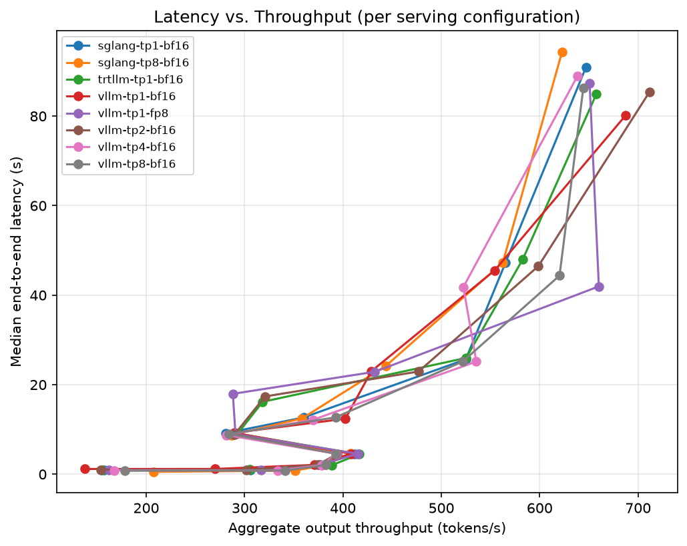
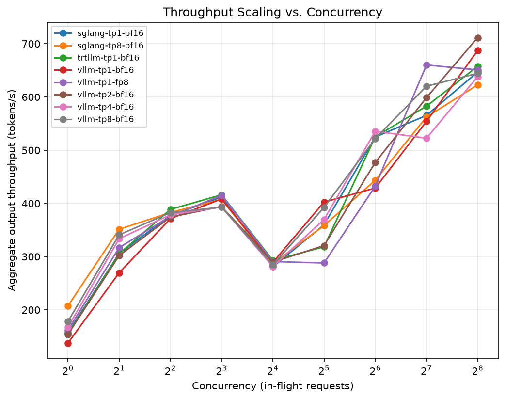
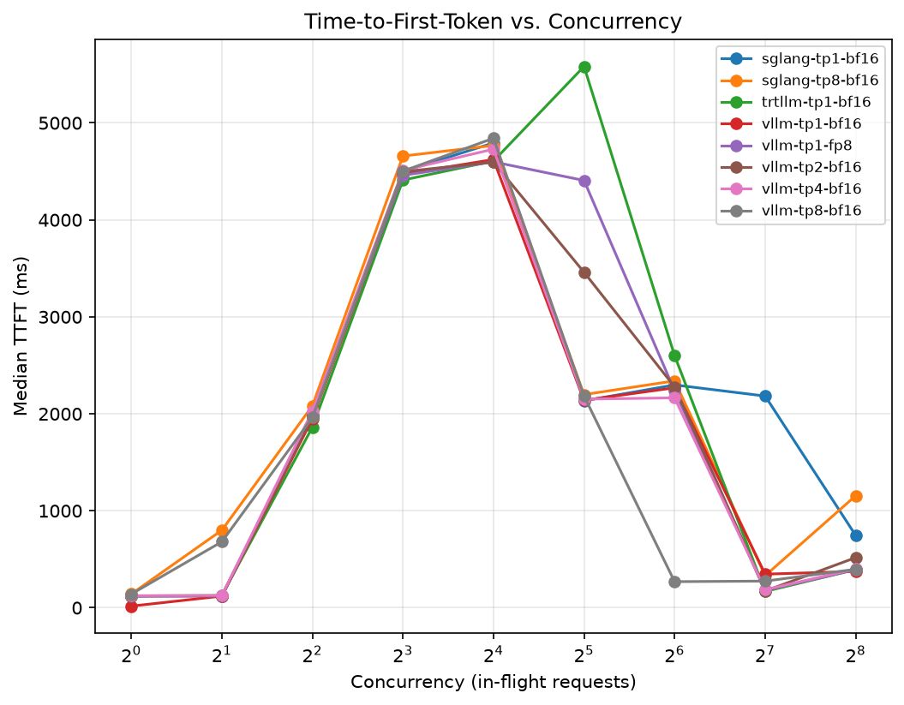

# OneRec-8B-Pro Serving Benchmark Report

_Generated automatically from `/home/nvadmin/onerec-serving/results` -- do not hand-edit; re-run `bench/generate_report.py` after any new benchmark run._

## Runs included

| Run | Engine |
|---|---|
| `sglang-tp1-bf16` | sglang |
| `sglang-tp8-bf16` | sglang |
| `trtllm-tp1-bf16` | trtllm |
| `vllm-tp1-bf16` | vllm |
| `vllm-tp1-fp8` | vllm |
| `vllm-tp2-bf16` | vllm |
| `vllm-tp4-bf16` | vllm |
| `vllm-tp8-bf16` | vllm |

## Throughput / concurrency sweep

- **Highest peak throughput:** `vllm-tp2-bf16` (712 output tok/s at concurrency=256)

- **Best low-concurrency TTFT:** `vllm-tp1-bf16` (17 ms p50 at concurrency=1)

| run             | engine   |   concurrency |   output_tok_s |   output_tok_s_per_gpu |   req_s |   ttft_p50_ms |   e2e_p50_s |   avg_gpu_util_pct |   avg_power_w |   tok_s_per_watt |   n_failed |
|:----------------|:---------|--------------:|---------------:|-----------------------:|--------:|--------------:|------------:|-------------------:|--------------:|-----------------:|-----------:|
| sglang-tp1-bf16 | sglang   |             1 |         157.18 |                 157.18 |    0.61 |        120.09 |        0.96 |              10.66 |        434.6  |             0.36 |          0 |
| sglang-tp1-bf16 | sglang   |             2 |         305.97 |                 305.97 |    1.2  |        122.26 |        0.97 |             100    |        735.63 |             0.42 |          0 |
| sglang-tp1-bf16 | sglang   |             4 |         377.34 |                 377.34 |    1.47 |       1970.49 |        2.07 |             100    |        742.1  |             0.51 |          0 |
| sglang-tp1-bf16 | sglang   |             8 |         411.83 |                 411.83 |    1.61 |       4498.3  |        4.54 |             100    |        731.35 |             0.56 |          1 |
| sglang-tp1-bf16 | sglang   |            16 |         280.85 |                 280.85 |    1.1  |       4793.89 |        9.17 |              37.5  |        402.2  |             0.7  |         32 |
| sglang-tp1-bf16 | sglang   |            32 |         359.88 |                 359.88 |    1.41 |       2134.54 |       12.67 |              40    |        397.66 |             0.91 |         32 |
| sglang-tp1-bf16 | sglang   |            64 |         524.84 |                 524.84 |    2.05 |       2297.98 |       25.66 |              66.5  |        597.07 |             0.88 |         23 |
| sglang-tp1-bf16 | sglang   |           128 |         565.34 |                 565.34 |    2.21 |       2183.13 |       47.28 |              66.5  |        649.01 |             0.87 |         38 |
| sglang-tp1-bf16 | sglang   |           256 |         646.97 |                 646.97 |    2.53 |        745.58 |       90.86 |              74    |        734.7  |             0.88 |         35 |
| sglang-tp8-bf16 | sglang   |             1 |         207.57 |                  25.95 |    0.81 |        141.54 |        0.53 |              22.1  |       2306.89 |             0.09 |          0 |
| sglang-tp8-bf16 | sglang   |             2 |         351.47 |                  43.93 |    1.37 |        799.13 |        0.8  |              40.34 |       2760.96 |             0.13 |          0 |
| sglang-tp8-bf16 | sglang   |             4 |         382.89 |                  47.86 |    1.5  |       2082.4  |        2.08 |              52.93 |       2793.97 |             0.14 |          0 |
| sglang-tp8-bf16 | sglang   |             8 |         407.63 |                  50.95 |    1.59 |       4658.31 |        4.66 |              55.94 |       2816.66 |             0.14 |          1 |
| sglang-tp8-bf16 | sglang   |            16 |         286.95 |                  35.87 |    1.12 |       4767.28 |        8.75 |              16.48 |       2019.89 |             0.14 |         32 |
| sglang-tp8-bf16 | sglang   |            32 |         358.46 |                  44.81 |    1.4  |       2198.3  |       12.47 |              24.88 |       2066.22 |             0.17 |         32 |
| sglang-tp8-bf16 | sglang   |            64 |         443.51 |                  55.44 |    1.73 |       2339.51 |       24.18 |              49.75 |       2358.5  |             0.19 |         37 |
| sglang-tp8-bf16 | sglang   |           128 |         562.43 |                  70.3  |    2.2  |        331.13 |       47.24 |              53.15 |       2787.4  |             0.2  |         38 |
| sglang-tp8-bf16 | sglang   |           256 |         622.76 |                  77.84 |    2.43 |       1155.34 |       94.36 |              33.48 |       2626.9  |             0.24 |         37 |
| trtllm-tp1-bf16 | trtllm   |             1 |         155.11 |                 155.11 |    0.61 |        121.84 |        1    |               6.97 |        435.86 |             0.36 |          0 |
| trtllm-tp1-bf16 | trtllm   |             2 |         305.44 |                 305.44 |    1.19 |        126.32 |        1.02 |              99.59 |        711.04 |             0.43 |          0 |
| trtllm-tp1-bf16 | trtllm   |             4 |         388.66 |                 388.66 |    1.52 |       1861.89 |        2    |              98.05 |        721.27 |             0.54 |          0 |
| trtllm-tp1-bf16 | trtllm   |             8 |         416.23 |                 416.23 |    1.63 |       4410.56 |        4.46 |              99.75 |        717.58 |             0.58 |          1 |
| trtllm-tp1-bf16 | trtllm   |            16 |         292.91 |                 292.91 |    1.14 |       4606.9  |        9.07 |              37.12 |        306.46 |             0.96 |         32 |
| trtllm-tp1-bf16 | trtllm   |            32 |         318.41 |                 318.41 |    1.24 |       5582.29 |       16.18 |              56.86 |        491.12 |             0.65 |         48 |
| trtllm-tp1-bf16 | trtllm   |            64 |         525.2  |                 525.2  |    2.05 |       2600.17 |       25.98 |              59.8  |        505.18 |             1.04 |         24 |
| trtllm-tp1-bf16 | trtllm   |           128 |         582.7  |                 582.7  |    2.28 |        167.91 |       47.96 |              38.5  |        484.15 |             1.2  |         46 |
| trtllm-tp1-bf16 | trtllm   |           256 |         657.63 |                 657.63 |    2.57 |        393.95 |       84.94 |              33.23 |        501.39 |             1.31 |         46 |
| vllm-tp1-bf16   | vllm     |             1 |         137.69 |                 137.69 |    0.54 |         16.62 |        1.17 |              60.55 |        479.58 |             0.29 |          0 |
| vllm-tp1-bf16   | vllm     |             2 |         269.63 |                 269.63 |    1.05 |        120.02 |        1.18 |              88.31 |        648.84 |             0.42 |          0 |
| vllm-tp1-bf16   | vllm     |             4 |         371.37 |                 371.37 |    1.45 |       1948.7  |        2.09 |              88.25 |        654.87 |             0.57 |          0 |
| vllm-tp1-bf16   | vllm     |             8 |         408.39 |                 408.39 |    1.6  |       4471.62 |        4.58 |              88    |        653.8  |             0.62 |          1 |
| vllm-tp1-bf16   | vllm     |            16 |         289.3  |                 289.3  |    1.13 |       4622.43 |        9.25 |              32.12 |        371.64 |             0.78 |         32 |
| vllm-tp1-bf16   | vllm     |            32 |         402.47 |                 402.47 |    1.57 |       2139.73 |       12.4  |              48.2  |        452.08 |             0.89 |         26 |
| vllm-tp1-bf16   | vllm     |            64 |         428.86 |                 428.86 |    1.68 |       2268.35 |       23    |              54.83 |        542.21 |             0.79 |         48 |
| vllm-tp1-bf16   | vllm     |           128 |         554.21 |                 554.21 |    2.16 |        346.41 |       45.53 |              56.14 |        626.02 |             0.89 |         47 |
| vllm-tp1-bf16   | vllm     |           256 |         687.35 |                 687.35 |    2.68 |        374.59 |       80.15 |              53.57 |        671.31 |             1.02 |         48 |
| vllm-tp1-fp8    | vllm     |             1 |         161.86 |                 161.86 |    0.63 |        121.05 |        0.92 |               4.83 |        356.83 |             0.45 |          0 |
| vllm-tp1-fp8    | vllm     |             2 |         316.96 |                 316.96 |    1.24 |        120.76 |        0.93 |              85.1  |        541.42 |             0.59 |          0 |
| vllm-tp1-fp8    | vllm     |             4 |         375.76 |                 375.76 |    1.47 |       1982.39 |        2.08 |              84.89 |        546.64 |             0.69 |          0 |
| vllm-tp1-fp8    | vllm     |             8 |         415.25 |                 415.25 |    1.62 |       4459.78 |        4.56 |              84.89 |        548.25 |             0.76 |          1 |
| vllm-tp1-fp8    | vllm     |            16 |         290.75 |                 290.75 |    1.14 |       4598.27 |        8.95 |              30.75 |        339.81 |             0.86 |         32 |
| vllm-tp1-fp8    | vllm     |            32 |         288.07 |                 288.07 |    1.13 |       4406.39 |       17.96 |              40.83 |        374.8  |             0.77 |         56 |
| vllm-tp1-fp8    | vllm     |            64 |         432.39 |                 432.39 |    1.69 |       2237.8  |       22.88 |              46.4  |        437.99 |             0.99 |         47 |
| vllm-tp1-fp8    | vllm     |           128 |         660.15 |                 660.15 |    2.58 |        179.97 |       41.96 |              50.33 |        515.08 |             1.28 |         27 |
| vllm-tp1-fp8    | vllm     |           256 |         650.76 |                 650.76 |    2.54 |        392.6  |       87.29 |              50.86 |        611.28 |             1.06 |         47 |
| vllm-tp2-bf16   | vllm     |             1 |         153.96 |                  76.98 |    0.6  |        121.74 |        1.01 |               7.53 |        677.9  |             0.23 |          0 |
| vllm-tp2-bf16   | vllm     |             2 |         302.01 |                 151    |    1.18 |        122.82 |        1.01 |              86.95 |        972.23 |             0.31 |          0 |
| vllm-tp2-bf16   | vllm     |             4 |         374.21 |                 187.11 |    1.46 |       1980.65 |        2.09 |              86.08 |        984.5  |             0.38 |          0 |
| vllm-tp2-bf16   | vllm     |             8 |         394.18 |                 197.09 |    1.54 |       4496.93 |        4.53 |              86.83 |        980.66 |             0.4  |          3 |
| vllm-tp2-bf16   | vllm     |            16 |         289.66 |                 144.83 |    1.13 |       4595.78 |        8.87 |              31.56 |        648.28 |             0.45 |         32 |
| vllm-tp2-bf16   | vllm     |            32 |         320.79 |                 160.39 |    1.25 |       3459.88 |       17.37 |              47.36 |        759.15 |             0.42 |         44 |
| vllm-tp2-bf16   | vllm     |            64 |         476.92 |                 238.46 |    1.86 |       2277.86 |       22.94 |              48.6  |        813.54 |             0.59 |         35 |
| vllm-tp2-bf16   | vllm     |           128 |         598.7  |                 299.35 |    2.34 |        172.5  |       46.5  |              51.25 |        901.5  |             0.66 |         46 |
| vllm-tp2-bf16   | vllm     |           256 |         711.51 |                 355.76 |    2.78 |        517.07 |       85.36 |              50.86 |       1023.09 |             0.7  |         25 |
| vllm-tp4-bf16   | vllm     |             1 |         167.58 |                  41.89 |    0.65 |        124.26 |        0.85 |               7.96 |       1204.73 |             0.14 |          0 |
| vllm-tp4-bf16   | vllm     |             2 |         333.65 |                  83.41 |    1.3  |        126.34 |        0.85 |              84.4  |       1618.76 |             0.21 |          0 |
| vllm-tp4-bf16   | vllm     |             4 |         378.57 |                  94.64 |    1.48 |       2026.41 |        2.06 |              84.03 |       1624.13 |             0.23 |          0 |
| vllm-tp4-bf16   | vllm     |             8 |         393.29 |                  98.32 |    1.54 |       4511    |        4.56 |              84.08 |       1624.74 |             0.24 |          3 |
| vllm-tp4-bf16   | vllm     |            16 |         281.4  |                  70.35 |    1.1  |       4729.35 |        8.75 |              12.92 |       1002.43 |             0.28 |         32 |
| vllm-tp4-bf16   | vllm     |            32 |         369.73 |                  92.43 |    1.44 |       2151.59 |       12.18 |              31.45 |       1191.25 |             0.31 |         32 |
| vllm-tp4-bf16   | vllm     |            64 |         535.62 |                 133.9  |    2.09 |       2164.61 |       25.16 |              46.2  |       1394.86 |             0.38 |         24 |
| vllm-tp4-bf16   | vllm     |           128 |         522.41 |                 130.6  |    2.04 |        185.78 |       41.81 |              48.33 |       1494.79 |             0.35 |         63 |
| vllm-tp4-bf16   | vllm     |           256 |         638.34 |                 159.58 |    2.49 |        400.58 |       88.92 |              48.43 |       1648.18 |             0.39 |         46 |
| vllm-tp8-bf16   | vllm     |             1 |         178.13 |                  22.27 |    0.7  |        140.53 |        0.77 |              12.49 |       2215.89 |             0.08 |          0 |
| vllm-tp8-bf16   | vllm     |             2 |         340.95 |                  42.62 |    1.33 |        680.27 |        0.81 |              82.4  |       2663.6  |             0.13 |          0 |
| vllm-tp8-bf16   | vllm     |             4 |         382.65 |                  47.83 |    1.49 |       1961.45 |        2.06 |              82.57 |       2696.08 |             0.14 |          0 |
| vllm-tp8-bf16   | vllm     |             8 |         392.96 |                  49.12 |    1.53 |       4502.55 |        4.59 |              70.74 |       2621.35 |             0.15 |          3 |
| vllm-tp8-bf16   | vllm     |            16 |         284.42 |                  35.55 |    1.11 |       4841.97 |        8.98 |              23.67 |       2102.15 |             0.14 |         32 |
| vllm-tp8-bf16   | vllm     |            32 |         392.44 |                  49.05 |    1.53 |       2183.5  |       12.7  |              45.58 |       2271.4  |             0.17 |         25 |
| vllm-tp8-bf16   | vllm     |            64 |         521.78 |                  65.22 |    2.04 |        269.06 |       25.17 |              45.25 |       2392.46 |             0.22 |         24 |
| vllm-tp8-bf16   | vllm     |           128 |         620.18 |                  77.52 |    2.42 |        274.62 |       44.37 |              43.95 |       2450.07 |             0.25 |         27 |
| vllm-tp8-bf16   | vllm     |           256 |         644.34 |                  80.54 |    2.52 |        396.83 |       86.26 |              41.06 |       2729.09 |             0.24 |         47 |

## Single-user latency sweep (concurrency = 1)

| run             | engine   |   input_len |   output_len |   ttft_p50_ms |   ttft_p99_ms |   e2e_p50_s |   e2e_p99_s |   mean_itl_ms |   n_failed |
|:----------------|:---------|------------:|-------------:|--------------:|--------------:|------------:|------------:|--------------:|-----------:|
| sglang-tp1-bf16 | sglang   |         128 |          128 |        11.327 |        12.878 |       0.477 |       0.48  |         3.666 |          0 |
| sglang-tp1-bf16 | sglang   |         128 |          256 |        10.413 |        11.338 |       0.948 |       0.948 |         3.676 |          0 |
| sglang-tp1-bf16 | sglang   |         512 |          128 |        13.986 |        14.484 |       0.483 |       0.484 |         3.691 |          0 |
| sglang-tp1-bf16 | sglang   |         512 |          256 |        14.053 |        14.837 |       0.956 |       0.958 |         3.694 |          0 |
| sglang-tp1-bf16 | sglang   |        2048 |          128 |        32.037 |        38.128 |       0.511 |       0.517 |         3.77  |          0 |
| sglang-tp1-bf16 | sglang   |        2048 |          256 |        32.545 |        33.91  |       0.994 |       0.996 |         3.772 |          0 |
| sglang-tp8-bf16 | sglang   |         128 |          128 |        14.303 |        17.79  |       0.275 |       0.279 |         2.051 |          0 |
| sglang-tp8-bf16 | sglang   |         128 |          256 |        13.294 |        17.568 |       0.537 |       0.55  |         2.052 |          0 |
| sglang-tp8-bf16 | sglang   |         512 |          128 |        13.416 |        17.355 |       0.272 |       0.278 |         2.031 |          0 |
| sglang-tp8-bf16 | sglang   |         512 |          256 |        13.712 |        17.08  |       0.534 |       0.544 |         2.033 |          0 |
| sglang-tp8-bf16 | sglang   |        2048 |          128 |        20.374 |        29.153 |       0.281 |       0.293 |         2.051 |          0 |
| sglang-tp8-bf16 | sglang   |        2048 |          256 |        20.997 |        23.117 |       0.546 |       0.56  |         2.053 |          0 |
| trtllm-tp1-bf16 | trtllm   |         128 |          128 |        23.499 |        28.763 |       0.509 |       0.527 |         3.83  |          0 |
| trtllm-tp1-bf16 | trtllm   |         128 |          256 |        22.912 |        27.821 |       0.999 |       1.005 |         3.828 |          0 |
| trtllm-tp1-bf16 | trtllm   |         512 |          128 |        23.345 |        29.286 |       0.511 |       0.516 |         3.836 |          0 |
| trtllm-tp1-bf16 | trtllm   |         512 |          256 |        23.494 |        25.608 |       1.003 |       1.008 |         3.841 |          0 |
| trtllm-tp1-bf16 | trtllm   |        2048 |          128 |        32.066 |        33.964 |       0.529 |       0.531 |         3.909 |          0 |
| trtllm-tp1-bf16 | trtllm   |        2048 |          256 |        31.911 |        32.533 |       1.03  |       1.034 |         3.914 |          0 |
| vllm-tp1-bf16   | vllm     |         128 |          128 |        12.165 |        13.287 |       0.585 |       0.597 |         4.515 |          0 |
| vllm-tp1-bf16   | vllm     |         128 |          256 |        12.021 |        13.18  |       1.162 |       1.164 |         4.511 |          0 |
| vllm-tp1-bf16   | vllm     |         512 |          128 |        14.839 |        15.584 |       0.592 |       0.6   |         4.547 |          0 |
| vllm-tp1-bf16   | vllm     |         512 |          256 |        14.751 |        16.08  |       1.179 |       1.19  |         4.569 |          0 |
| vllm-tp1-bf16   | vllm     |        2048 |          128 |        33.512 |        35.424 |       0.625 |       0.626 |         4.653 |          0 |
| vllm-tp1-bf16   | vllm     |        2048 |          256 |        33.716 |        37.64  |       1.208 |       1.222 |         4.621 |          0 |
| vllm-tp1-fp8    | vllm     |         128 |          128 |        11.001 |        11.555 |       0.46  |       0.469 |         3.553 |          0 |
| vllm-tp1-fp8    | vllm     |         128 |          256 |        10.995 |        11.869 |       0.914 |       0.917 |         3.543 |          0 |
| vllm-tp1-fp8    | vllm     |         512 |          128 |        13.841 |        14.346 |       0.473 |       0.474 |         3.613 |          0 |
| vllm-tp1-fp8    | vllm     |         512 |          256 |        13.852 |        14.621 |       0.937 |       0.938 |         3.619 |          0 |
| vllm-tp1-fp8    | vllm     |        2048 |          128 |        28.071 |        28.501 |       0.488 |       0.489 |         3.623 |          0 |
| vllm-tp1-fp8    | vllm     |        2048 |          256 |        28.158 |        30.033 |       0.952 |       0.954 |         3.623 |          0 |
| vllm-tp2-bf16   | vllm     |         128 |          128 |        12.026 |        13.413 |       0.504 |       0.506 |         3.875 |          0 |
| vllm-tp2-bf16   | vllm     |         128 |          256 |        11.556 |        12.333 |       1     |       1.001 |         3.876 |          0 |
| vllm-tp2-bf16   | vllm     |         512 |          128 |        14.558 |        15.678 |       0.509 |       0.511 |         3.892 |          0 |
| vllm-tp2-bf16   | vllm     |         512 |          256 |        15.071 |        16.307 |       1.007 |       1.009 |         3.892 |          0 |
| vllm-tp2-bf16   | vllm     |        2048 |          128 |        28.258 |        30.411 |       0.53  |       0.533 |         3.953 |          0 |
| vllm-tp2-bf16   | vllm     |        2048 |          256 |        28.344 |        30.151 |       1.036 |       1.038 |         3.951 |          0 |
| vllm-tp4-bf16   | vllm     |         128 |          128 |        11.205 |        13.192 |       0.423 |       0.428 |         3.247 |          0 |
| vllm-tp4-bf16   | vllm     |         128 |          256 |        11.522 |        12.606 |       0.842 |       0.844 |         3.254 |          0 |
| vllm-tp4-bf16   | vllm     |         512 |          128 |        13.442 |        14.086 |       0.428 |       0.429 |         3.267 |          0 |
| vllm-tp4-bf16   | vllm     |         512 |          256 |        13.525 |        14.216 |       0.843 |       0.844 |         3.251 |          0 |
| vllm-tp4-bf16   | vllm     |        2048 |          128 |        25.098 |        28.073 |       0.445 |       0.449 |         3.304 |          0 |
| vllm-tp4-bf16   | vllm     |        2048 |          256 |        24.925 |        28.547 |       0.868 |       0.871 |         3.306 |          0 |
| vllm-tp8-bf16   | vllm     |         128 |          128 |        12.161 |        13.271 |       0.389 |       0.392 |         2.972 |          0 |
| vllm-tp8-bf16   | vllm     |         128 |          256 |        11.988 |        12.324 |       0.768 |       0.771 |         2.965 |          0 |
| vllm-tp8-bf16   | vllm     |         512 |          128 |        13.175 |        13.694 |       0.391 |       0.393 |         2.979 |          0 |
| vllm-tp8-bf16   | vllm     |         512 |          256 |        12.92  |        13.789 |       0.771 |       0.772 |         2.971 |          0 |
| vllm-tp8-bf16   | vllm     |        2048 |          128 |        25.94  |        30.071 |       0.408 |       0.412 |         3.005 |          0 |
| vllm-tp8-bf16   | vllm     |        2048 |          256 |        26.506 |        29.466 |       0.793 |       0.796 |         3.004 |          0 |

## Data quality flags: request failures under load

Non-zero `n_failed` at a concurrency level means the numbers at **that level and above should not be trusted for capacity planning** until root-caused (see `docs/RUNBOOK.md` -> 'Interpreting failed/anomalous throughput results'). Breakdown:

- `sglang-tp1-bf16` @ concurrency=8: 1 failed -- `Server disconnected` x1
- `sglang-tp1-bf16` @ concurrency=16: 32 failed -- `Server disconnected` x32
- `sglang-tp1-bf16` @ concurrency=32: 32 failed -- `Server disconnected` x32
- `sglang-tp1-bf16` @ concurrency=64: 23 failed -- `Server disconnected` x23
- `sglang-tp1-bf16` @ concurrency=128: 38 failed -- `Server disconnected` x38
- `sglang-tp1-bf16` @ concurrency=256: 35 failed -- `Server disconnected` x35
- `sglang-tp8-bf16` @ concurrency=8: 1 failed -- `Server disconnected` x1
- `sglang-tp8-bf16` @ concurrency=16: 32 failed -- `Server disconnected` x32
- `sglang-tp8-bf16` @ concurrency=32: 32 failed -- `Server disconnected` x32
- `sglang-tp8-bf16` @ concurrency=64: 37 failed -- `Server disconnected` x37
- `sglang-tp8-bf16` @ concurrency=128: 38 failed -- `Server disconnected` x38
- `sglang-tp8-bf16` @ concurrency=256: 37 failed -- `Server disconnected` x37
- `vllm-tp2-bf16` @ concurrency=8: 3 failed -- `Server disconnected` x3
- `vllm-tp2-bf16` @ concurrency=16: 32 failed -- `Server disconnected` x32
- `vllm-tp2-bf16` @ concurrency=32: 44 failed -- `Server disconnected` x44
- `vllm-tp2-bf16` @ concurrency=64: 35 failed -- `Server disconnected` x35
- `vllm-tp2-bf16` @ concurrency=128: 46 failed -- `Server disconnected` x46
- `vllm-tp2-bf16` @ concurrency=256: 25 failed -- `Server disconnected` x25
- `vllm-tp4-bf16` @ concurrency=8: 3 failed -- `Server disconnected` x3
- `vllm-tp4-bf16` @ concurrency=16: 32 failed -- `Server disconnected` x32
- `vllm-tp4-bf16` @ concurrency=32: 32 failed -- `Server disconnected` x32
- `vllm-tp4-bf16` @ concurrency=64: 24 failed -- `Server disconnected` x24
- `vllm-tp4-bf16` @ concurrency=128: 63 failed -- `Server disconnected` x63
- `vllm-tp4-bf16` @ concurrency=256: 46 failed -- `Server disconnected` x46
- `vllm-tp8-bf16` @ concurrency=8: 3 failed -- `Server disconnected` x3
- `vllm-tp8-bf16` @ concurrency=16: 32 failed -- `Server disconnected` x32
- `vllm-tp8-bf16` @ concurrency=32: 25 failed -- `Server disconnected` x25
- `vllm-tp8-bf16` @ concurrency=64: 24 failed -- `Server disconnected` x24
- `vllm-tp8-bf16` @ concurrency=128: 27 failed -- `Server disconnected` x27
- `vllm-tp8-bf16` @ concurrency=256: 47 failed -- `Server disconnected` x47

## How to read this report

- **TTFT (time-to-first-token)** approximates perceived responsiveness for an interactive/streaming UI.
- **E2E latency** is full request completion time (prefill + decode of all output tokens).
- **Throughput (tokens/s)** is aggregate *output* token throughput across all concurrent in-flight requests at that load level -- this is what determines how many GPUs/replicas you need to serve a given QPS target.
- **tok/s/GPU** normalizes throughput by GPU count so tensor-parallel configs can be compared fairly against single-GPU replicas.
- See `docs/BENCHMARK_METHODOLOGY.md` for full methodology and `docs/SERVING_OPTIONS.md` for qualitative engine trade-offs.
